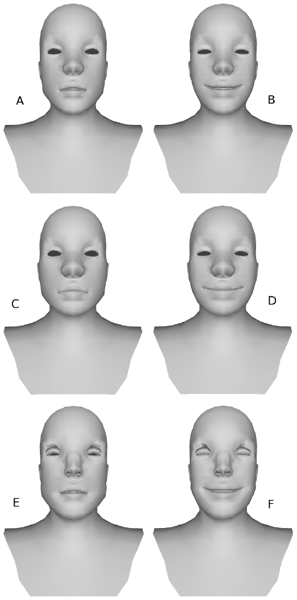

Implementation of the expression transfer operator from the paper:

> *Online modeling for realtime facial animation*
> 
> S Bouaziz, Y Wang, M Pauly
> 
> ACM Transactions on Graphics (TOG), 2013
> 
> https://doi.org/10.1145/2461912.2461976

## Some results

Faces D and F were obtained by applying the transformation from A to B in C and E respectively.

